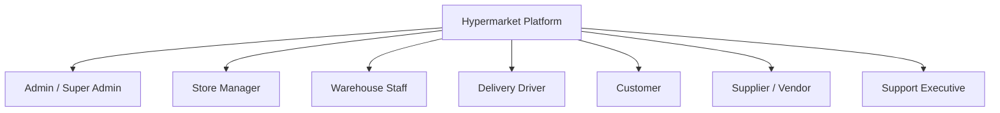
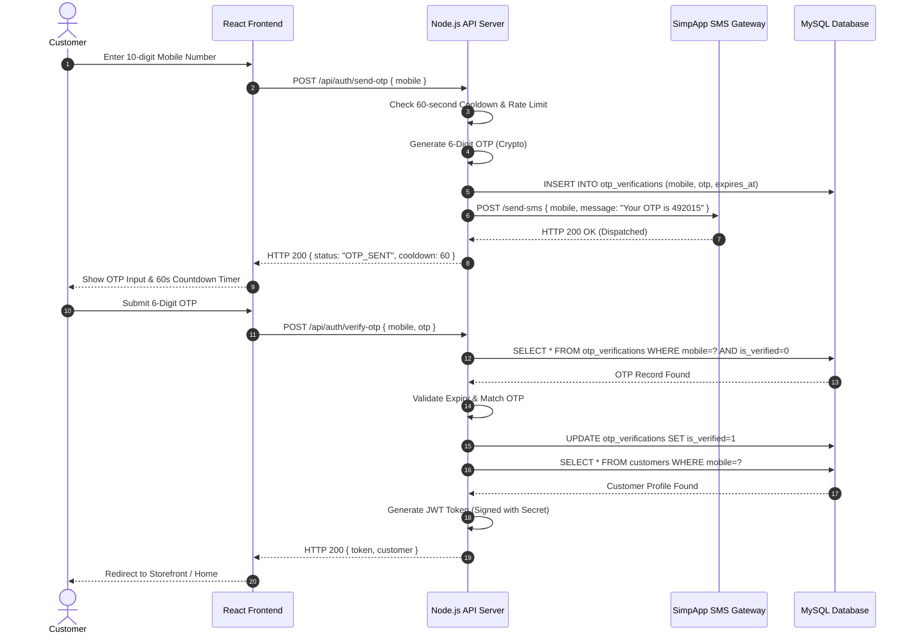
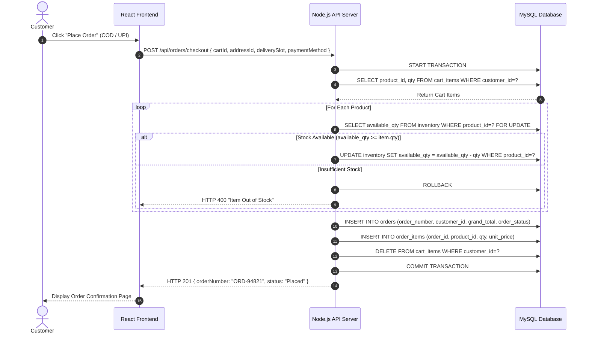
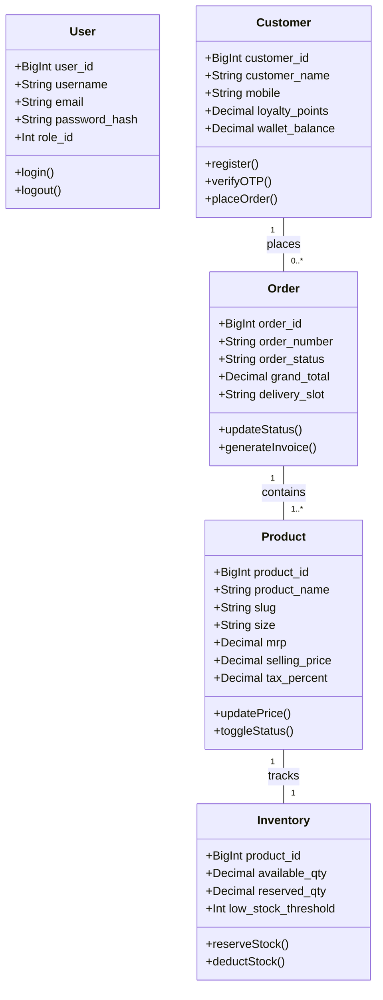
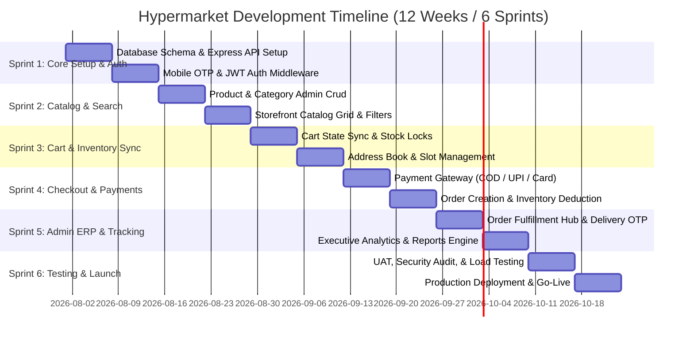

# Software Requirements Specification (SRS)
## Enterprise Hypermarket E-Commerce & ERP Platform

---

## 1. Business Overview

### 1.1 Project Name
**Hypermarket Web Application (Supermarket ERP & Omni-channel E-Commerce Platform)**

### 1.2 Business Goal
To empower retail hypermarket chains and supermarkets to seamlessly bridge physical inventory management with a high-performance, real-time omni-channel e-commerce experience. The system optimizes retail workflows, reduces order fulfillment latency to under 30 minutes, eliminates inventory discrepancy, and maximizes customer retention via loyalty and wallet integrations.

### 1.3 Problem Statement
Traditional hypermarket retailers face critical operational bottlenecks:
- **Inventory Mismatch**: Discrepancies between physical shelf stock and online store availability leading to order cancellations.
- **Manual ERP Bottlenecks**: Disconnected point-of-sale (POS), warehouse, and web storefront systems.
- **Suboptimal Customer Retention**: Lack of unified loyalty, wallet cashback, and personalized delivery slot scheduling.
- **Logistics Latency**: High delivery fulfillment times without real-time OTP validation and driver tracking.

### 1.4 Target Users
- **B2C Shoppers / Online Customers**: Consumers buying daily groceries, household goods, fresh produce, and consumer electronics.
- **Hypermarket Store Management & Admin**: Executives, inventory controllers, order dispatch managers, and store managers.
- **Warehouse & Delivery Personnel**: Packers, warehouse fulfillment staff, and last-mile delivery drivers.

### 1.5 Target Country / Region
- Primary: India (with standard support for GST tax calculations, HSN codes, Indian Rupee ₹ currency formatting, 10-digit mobile phone numbers, and local payment methods such as UPI, COD, Wallets, and NetBanking).
- Multi-region architecture ready for international expansion (multi-currency and multi-tax support).

### 1.6 Business Model
- **B2C Direct Retail / Omni-channel Hypermarket**: Single-vendor or multi-branch supermarket chain selling directly to end-consumers.
- Future multi-vendor marketplace transformation capability.

### 1.7 Revenue Model
- **Direct Product Margin**: Sales revenue generated from grocery and retail items.
- **Delivery Fees**: Tiered and distance-based delivery charges.
- **Promotional & Brand Placement Fees**: Featured product placements and top-banner advertising for supplier brands.

### 1.8 Competitor Analysis
| Feature / Aspect | Hypermarket Web App (This System) | Competitor A (Blinkit / Zepto) | Competitor B (BigBasket) |
|---|---|---|---|
| **Inventory Sync** | Direct ERP real-time lock | Dark store fast dispatch | Central & local hub sync |
| **Authentication** | Mobile OTP + Email/Password Dual Auth | Mobile OTP only | Mobile OTP + Social |
| **Delivery Model** | Scheduled Slots + Express Delivery | 10-minute instant | Scheduled & Daily Subscriptions |
| **ERP Integration** | Fully integrated inventory, orders, & reports | Specialized proprietary | ERP & WMS integrations |

### 1.9 Project Scope
- End-to-end B2C E-Commerce customer web portal.
- Full Admin & ERP operations portal for inventory, catalog, order processing, and customer analytics.
- Real-time cart management, stock auto-deduction, slot scheduling, and payment handling.
- Role-Based Access Control (RBAC) security, JWT authentication, and SMS OTP gateway integration.

### 1.10 Out of Scope (Phase 1)
- Multi-vendor commission marketplace model (scheduled for Version 3 roadmap).
- Native iOS / Android mobile apps (React Native app planned for Version 2).
- Automated hardware integration with automated robotic dark store conveyor belts.

---

## 2. User Roles & Permissions



### 2.1 Admin / Super Admin
- **Responsibilities**: Overall platform governance, system configuration, staff role allocation, global pricing, taxation rules, payment/SMS gateway settings, and enterprise analytics.
- **Permissions**: Full CRUD access across all tables and modules.
- **Accessible Modules**: All modules (Dashboard, Products, Categories, Inventory, Orders, Marketing, Customers, Reports, Staff, Settings, Logs).
- **Dashboard**: Global metrics (Total Revenue, Active Orders, Low Stock Alerts, Top Categories, Customer Acquisition).
- **Restrictions**: Cannot delete own active Super Admin account.

### 2.2 Store Manager
- **Responsibilities**: Daily store operations, order fulfillment oversight, price/discount approvals, local store inventory adjustments, and banner marketing management.
- **Permissions**: Read/Write on Products, Inventory, Orders, Categories, Banners, and Customer queries. No access to system settings or database backups.
- **Accessible Modules**: Dashboard, Product Management, Inventory, Orders, Banners, Customer Management, Reports.
- **Dashboard**: Today's Orders, Pending Dispatches, Stock Out Alerts, Revenue Summary.
- **Restrictions**: Cannot alter tax structures, system security configurations, or create Super Admin accounts.

### 2.3 Warehouse Staff
- **Responsibilities**: Picking items, packing orders, stock replenishment, receiving purchase entries, damaged item logging, and bin allocation.
- **Permissions**: Read/Update access to Order status (Packed/Ready), Inventory counts, Stock Adjustments, and Damaged Stock logs.
- **Accessible Modules**: Inventory, Stock Adjustments, Order Fulfillment Panel.
- **Dashboard**: Pick-list queue, Out-of-stock items, Incoming purchase orders.
- **Restrictions**: No access to customer financial details, customer management, or marketing modules.

### 2.4 Delivery Driver / Delivery Personnel
- **Responsibilities**: Order pickup, route execution, customer OTP verification upon delivery, proof of delivery (POD) collection, and cash collection for COD orders.
- **Permissions**: Update assigned order status to 'Out for Delivery' / 'Delivered' / 'Failed'. Read customer delivery address and contact number.
- **Accessible Modules**: Driver Delivery Portal / App.
- **Dashboard**: Assigned Deliveries list, Route navigation map link, Completed Deliveries, Cash Collected summary.
- **Restrictions**: Access limited strictly to orders explicitly assigned to the delivery driver.

### 2.5 Customer (B2C Shopper)
- **Responsibilities**: Browsing catalog, managing cart/wishlist, placing orders, making payments, tracking delivery, submitting reviews, and managing profile.
- **Permissions**: Self-account management, order placement, review submission, address book modification.
- **Accessible Modules**: Customer Storefront Portal (Home, Product Detail, Cart, Checkout, Order Tracking, User Profile, Wallet, Loyalty).
- **Dashboard**: Customer Account Overview (Active Orders, Recent Purchases, Wallet Balance, Loyalty Points, Saved Addresses).
- **Restrictions**: No access to admin APIs or other users' personal information.

---

## 3. Complete Feature List & Core Module Specifications

### 3.1 Authentication & Session Management Module

#### Purpose
To provide secure, multi-channel user identity verification, protecting sensitive customer financial data and admin operational functions.

#### Functional Requirements
1. **Mobile OTP Login**: Generate 6-digit cryptographic OTP, dispatch via SimpApp SMS gateway, verify within 5 minutes expiry.
2. **Rate Limiting**: Enforce a mandatory 60-second cooldown timer between resend OTP requests. Limit maximum 5 OTP attempts per mobile number per hour.
3. **JWT Session Token**: Issue HTTP Bearer JWT token upon successful auth (Expires in 24 hours for customer, 8 hours for admin).
4. **Password Hashing**: Passwords MUST be hashed using `bcryptjs` with a salt rounds value of 10.

---

## 4. Customer Storefront Portal Specification

### 4.1 Page Breakdown & APIs
- **Home (`/`)**: Banners slider (`GET /api/banners/active`), Featured products (`GET /api/products/featured`), Category carousel (`GET /api/categories`).
- **Product Listing (`/products`)**: Dynamic filtering & pagination (`GET /api/products`).
- **Product Detail (`/products/:slug`)**: Specifications, variant size, MRP discount (`GET /api/products/:slug`).
- **Cart (`/cart`)**: Persistent sync, quantity stepper (`GET /api/cart`, `PUT /api/cart/items/:id`).
- **Checkout (`/checkout`)**: Slot selection, address picker, payment options (`POST /api/orders/checkout`).
- **Order Tracking (`/orders/:orderNumber`)**: Real-time progress bar (`GET /api/orders/:orderNumber/track`).

---

## 5. Admin & ERP Management Portal Specification

### 5.1 Admin Operations Modules
- **Dashboard (`/admin/dashboard`)**: KPI widgets (Revenue, Active Orders, Low Stock Alerts).
- **Product Manager (`/admin/products`)**: Smart Autocomplete search auto-fills attributes, HSN code, tax rates, `size` attributes.
- **Inventory Controller (`/admin/inventory`)**: Available vs Reserved stock locks, low-stock threshold triggers.
- **Order Fulfillment (`/admin/orders`)**: Lifecycle updates (`Placed` ➔ `Confirmed` ➔ `Packed` ➔ `OutForDelivery` ➔ `Delivered`), driver assignment, PDF invoice printing.
- **Banners Manager (`/admin/banners`)**: Homepage hero banner sliders, start/end dates, priority levels.

---

## 6. Product & Inventory Architecture

### 6.1 Database ERD & DDL (`supermarket_erp`)
```sql
CREATE TABLE IF NOT EXISTS products (
    product_id BIGINT AUTO_INCREMENT PRIMARY KEY,
    product_name VARCHAR(200) NOT NULL,
    slug VARCHAR(250) UNIQUE NOT NULL,
    category_id INT,
    brand_id INT,
    unit_id INT,
    size VARCHAR(50) NULL,
    mrp DECIMAL(10,2) NOT NULL DEFAULT 0.00,
    selling_price DECIMAL(10,2) NOT NULL DEFAULT 0.00,
    tax_percent DECIMAL(5,2) DEFAULT 0.00,
    hsn_code VARCHAR(20),
    is_active BIT DEFAULT 1,
    created_at DATETIME DEFAULT CURRENT_TIMESTAMP
) ENGINE=InnoDB;

CREATE TABLE IF NOT EXISTS inventory (
    product_id BIGINT PRIMARY KEY,
    available_qty DECIMAL(10,2) DEFAULT 0.00,
    reserved_qty DECIMAL(10,2) DEFAULT 0.00,
    low_stock_threshold INT DEFAULT 10,
    last_updated DATETIME DEFAULT CURRENT_TIMESTAMP ON UPDATE CURRENT_TIMESTAMP,
    FOREIGN KEY (product_id) REFERENCES products(product_id) ON DELETE CASCADE
) ENGINE=InnoDB;
```

---

## 7. Order & Delivery Workflow

### 7.1 Delivery OTP Verification Workflow
1. Driver arrives at customer destination.
2. Driver prompts customer for 4-digit Delivery OTP.
3. Driver inputs OTP into Driver App (`POST /api/orders/verify-delivery-otp`).
4. Upon successful validation, order status transitions automatically to `Delivered`.

---

## 8. Screen Wireframes (ASCII UI Layouts)

### 8.1 Customer Storefront Home Page Wireframe
```text
+-----------------------------------------------------------------------------------+
|  [LOGO] Hypermarket    [ Deliver To: 560038 Bangalore v ]  [ Search Products... ] |
|  [Categories v]  [Offers]  [My Orders]                 [ Loyalty: 150 pts ] [Cart (3)] |
+-----------------------------------------------------------------------------------+
|  +-----------------------------------------------------------------------------+  |
|  | HERO BANNER: Fresh Organic Vegetables - Up to 40% OFF!                     |  |
|  | [ Shop Vegetables Now ]                                                     |  |
|  +-----------------------------------------------------------------------------+  |
+-----------------------------------------------------------------------------------+
| SHOP BY CATEGORY                                                                  |
| [Fruits & Veg]   [Dairy & Eggs]   [Beverages]   [Snacks]   [Household]  [Meat]   |
+-----------------------------------------------------------------------------------+
| FEATURED PRODUCTS                                                                 |
| +-----------------+  +-----------------+  +-----------------+  +-----------------+ |
| | [Image: Milk]   |  | [Image: Bread]  |  | [Image: Butter] |  | [Image: Rice]   | |
| | Fresh Milk 1L   |  | Whole Wheat 400g|  | Amul Butter 100g|  | Basmati Rice 5kg| |
| | ₹64  <s style="color:red">₹70</s>  |  | ₹45  <s style="color:red">₹50</s>  |  | ₹58  <s style="color:red">₹62</s>  |  | ₹499 <s style="color:red">₹650</s> | |
| | [ + ADD ]       |  | [ - 2 + ]       |  | [ + ADD ]       |  | [ + ADD ]       | |
| +-----------------+  +-----------------+  +-----------------+  +-----------------+ |
+-----------------------------------------------------------------------------------+
| FOOTER: About Us | Store Locator | Help Center | Terms & Privacy | Contact Us     |
+-----------------------------------------------------------------------------------+
```

### 8.2 Admin Dashboard Wireframe
```text
+-----------------------------------------------------------------------------------+
| HYPERMARKET ERP ADMIN  |  [ Search SKU... ]             [ Notification (4) ] [Admin v] |
+------------------+----------------------------------------------------------------+
| > Dashboard      | OVERVIEW METRICS (TODAY)                                       |
| > Product Catalog| +----------------+ +----------------+ +----------------+ +--------+ |
| > Inventory Stock| | Total Revenue  | | Total Orders   | | Active Customers| | Stock  | |
| > Orders Hub     | | ₹ 1,48,250    | | 342 Orders     | | 1,204 Active   | | 12 Alert| |
| > Banners        | +----------------+ +----------------+ +----------------+ +--------+ |
| > Customers      |                                                                |
| > Reports        | REVENUE TREND (30 DAYS)          RECENT ORDERS                 |
| > Settings       | [------------------- CHART ---]  Ord #1042  ₹1,240  [Processing]|
|                  | [=============================]  Ord #1041  ₹  650  [Dispatched]|
|                  | [-----------------------------]  Ord #1040  ₹3,100  [Delivered] |
+------------------+----------------------------------------------------------------+
```

---

## 9. Sequence Diagrams

### 9.1 Mobile OTP Login Sequence Diagram



### 9.2 Checkout & Inventory Deduction Sequence Diagram



---

## 10. Complete UML Diagrams

### 10.1 System Class Diagram



---

## 11. Test Cases Suite

| Test Case ID | Module | Feature Under Test | Preconditions | Test Execution Steps | Expected Result | Pass/Fail Criteria |
|---|---|---|---|---|---|---|
| **TC-AUTH-001** | Auth | Mobile OTP Dispatch | Valid mobile number | 1. Enter `9876543210`<br>2. Click "Send OTP" | OTP sent response HTTP 200, 60s countdown starts | Pass if HTTP 200 & countdown active |
| **TC-AUTH-002** | Auth | OTP Cooldown Limit | OTP already sent <60s ago | 1. Click "Resend OTP" during countdown | Button disabled; request blocked client-side | Pass if button disabled |
| **TC-INV-001** | Inventory | Stock Auto-Deduction | Product stock = 50 | 1. Place order for 2 units<br>2. Complete checkout | Database stock updated to 48 | Pass if SQL stock = 48 |
| **TC-ORD-001** | Orders | Insufficient Stock Checkout | Product stock = 1 | 1. Add 3 units to cart<br>2. Attempt Checkout | Order blocked with HTTP 400 "Insufficient Stock" | Pass if transaction rolls back |
| **TC-ADM-001** | Admin | Autocomplete Product Edit | Existing product "Amul Milk" | 1. Type "Amul Milk" in Admin Product Name input | Form auto-fills existing attributes & switches to Edit mode | Pass if form pre-populates |

---

## 12. Agile Sprint Planning & Project Management

### 12.1 6-Sprint Milestone Breakdown (12 Weeks Execution)



---

## 13. Non-Functional Requirements (NFR)

### 13.1 Performance & SLAs
- **API Response Latency**: 95th percentile API response time `< 150ms`.
- **Page Load Time**: First Contentful Paint (FCP) `< 1.2 seconds` on 4G networks.
- **Throughput**: System capable of handling **1,500 concurrent active shopping sessions** without degradation.

### 13.2 Availability & Reliability
- **System Uptime SLA**: **99.9% Uptime** (Max allowable unscheduled downtime < 8.7 hours/year).
- **Recovery Point Objective (RPO)**: `< 5 minutes` data loss risk via real-time transaction logging.
- **Recovery Time Objective (RTO)**: `< 1 hour` full disaster recovery restore time.

### 13.3 Maintainability & Scalability
- **Horizontal Scaling**: Stateless Express API nodes behind Nginx load balancers.
- **Code Standards**: TypeScript type-safety on frontend, ESLint enforcement, and modular controller architecture.

---

## 14. Analytics, Logging & Observability

### 14.1 Structured JSON Logging
All backend events emit structured JSON logs to standard output:
```json
{
  "timestamp": "2026-07-21T10:45:00.120Z",
  "level": "INFO",
  "event": "ORDER_PLACED",
  "orderNumber": "ORD-94821",
  "customerId": 4021,
  "grandTotal": 1450.00,
  "paymentMethod": "UPI",
  "executionTimeMs": 42
}
```

### 14.2 Observability & Event Tracking Metrics
- **Business Funnel Analytics**: Cart Add Rate, Checkout Abandonment Rate, Payment Conversion Rate.
- **System Health Metrics**: Database Connection Pool utilization, CPU/Memory spikes, 4xx/5xx HTTP error counts.
